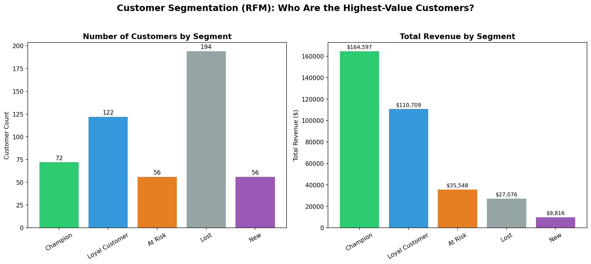

# Customer Segmentation via RFM Analysis

Not all customers are worth the same to a business — but without a systematic way to measure that, it's easy to treat them as if they are. This project applies RFM (Recency, Frequency, Monetary) analysis to a customer transaction dataset to segment customers by value, and to identify exactly who the business should be protecting, nurturing, or winning back.

## Business Question

Which customers are actually driving revenue, which ones are slipping away, and where should retention efforts be focused first?

## Dataset

Customer transaction dataset with 3,766 transactions across 500 unique customers, including:
- **transaction_id**, **customer_id**
- **order_date** — date of purchase
- **order_value** — revenue from that transaction

## Methodology

For each customer, three metrics were calculated as of a fixed snapshot date:
- **Recency (R)** — days since their last purchase (lower = better)
- **Frequency (F)** — total number of purchases (higher = better)
- **Monetary (M)** — total amount spent (higher = better)

Each metric was scored 1–4 using quartile binning, then combined into an RFM score and mapped to five business-friendly segments: **Champion**, **Loyal Customer**, **At Risk**, **New**, and **Lost**.

## Key Insights



**1. A small group of Champions drives almost half of all revenue**
Just 72 customers (14% of the customer base) are classified as Champions — yet they generate **47.3% of total revenue** ($164,597). This is a classic Pareto pattern: a small segment carries a disproportionate share of business value, and should be the top priority for retention (loyalty perks, early access, personal outreach).

**2. Nearly 1 in 10 customers is flagged "At Risk"**
56 customers who were previously frequent buyers have gone quiet recently. They still represent $35,548 in historical revenue — losing them silently would be a real (and avoidable) revenue leak. This is the segment with the clearest case for immediate action: a win-back campaign or personalized discount before they're gone for good.

**3. "Lost" is the largest group by count, but the smallest by value**
194 customers (the largest segment) fall into "Lost," yet they contribute only $27,076 combined — a fraction of what Champions alone generate. This confirms that customer *count* and customer *value* are not the same thing, and spending equal effort across all customers would be inefficient.

**4. Loyal Customers are a strong, stable middle tier**
122 customers are consistent repeat buyers generating $110,709 — the second-largest revenue contributor. This group is a natural pipeline for upgrading into Champions with the right engagement.

## Summary

| Segment | Customers | Total Revenue | Avg Revenue/Customer |
|---|---|---|---|
| Champion | 72 | $164,597 | $2,286 |
| Loyal Customer | 122 | $110,709 | $907 |
| At Risk | 56 | $35,548 | $635 |
| Lost | 194 | $27,076 | $140 |
| New | 56 | $9,816 | $175 |

- **Total customers analyzed:** 500
- **Champions generate 47.3% of total revenue**
- **56 customers flagged "At Risk" — act fast**

## Tools Used

- Python
- pandas (RFM calculation, quartile scoring, segmentation logic)
- matplotlib (visualization)

## How to Run

```bash
git clone https://github.com/yourusername/customer-rfm-segmentation.git
cd customer-rfm-segmentation
pip install -r requirements.txt
jupyter notebook rfm_segmentation.ipynb
```
